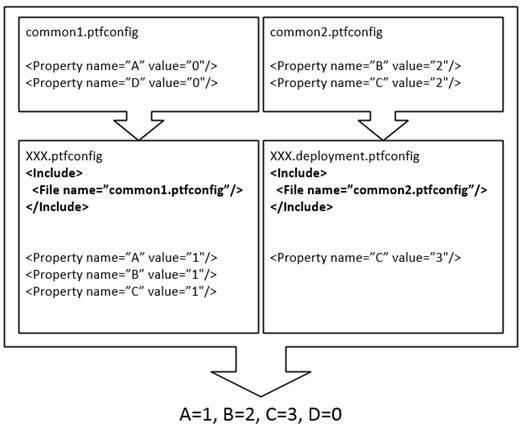
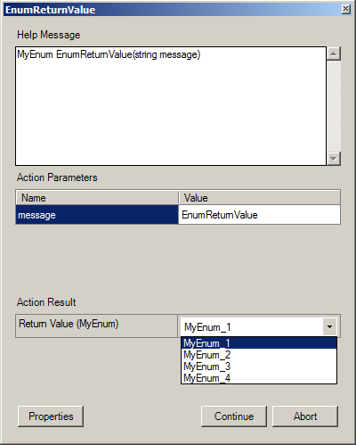
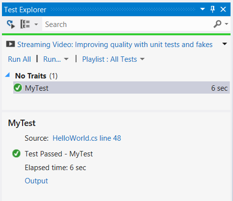

# Getting Started Guide for the Protocol Test Framework


## Abstract
This document provides an overview and a set of samples to help you get started with the Protocol Test Framework.

## Purpose of the Protocol Test Framework
The Protocol Test Framework is intended to support Microsoft Protocol Test Suites. Please refer to the [Microsoft Protocol Test Suite](http://www.microsoft.com/openspecifications/en/us/applied-interoperability/testing/default.aspx) documentation for further information regarding protocol test suites.

Refer to Creating a Test Suite Manually included as a simple test suite example. This is only intended to provide as a simple protocol test suite and test case.  It is not intended to provide guidance for the purpose of creating protocol test suites.


# Table of Contents

* [Protocol Test Environment Requirement](#2)
* [Key Features of Protocol Test Framework](#4)
    * [Default test environment](#4.1)
    * [PTF Configuration -- ptfconfig](#4.2)
    * [Protocol Test Adapters](#4.3)
    * [Extensive Logging Support](#4.4)
    * [Checkers](#4.5)
    * [Requirement Tracing](#4.6)
    * [Reporting Tool](#4.7)
    * [Auto Generate Test Report](#4.8)
    * [Automatic Network Capturing](#4.9)
    * [Display Expected/Actual runtime of testsuite](#4.10)
* [Creating a Protocol Test Suite Manually](#5)
    * [Create a Hello World Unit Test Project](#5.1)
    * [Using Adapters](#5.2)
    * [Run test cases](#5.3)


# Protocol Test Environment Requirements 

## Computer Systems

* SUT: system under test
    * Computer that is intended to be tested
* Test Driver Computer running Windows 8.1 or Windows Server 2012 R2

## Network Infrastructure
* A test network is required to connect the test computer systems
* It must consist of an isolated hub or switch
* It must not be connected to a production network or used for any other business or personal communications or operations
* It must not be connected to the internet
* IP addresses must be assigned for a test network
* Computer names should be assigned in a test network infrastructure
* User credentials used on the system must be dedicated to the test network infrastructure
* Details including computer IP addresses, names and credentials are saved in log files
    * Refer to the Detailed Logging Support section

Refer to the Privacy Statement and EULA for futher information


# Key Features of Protocol Test Framework 

## Default test environment 

PTF provides an interface, `ITestSite`, to represent the environment for test cases execution. The interface allows access to basic context information (like OS information), configuration, functions for error checking, and adapter instance generation. PTF also contains a default implementation of this interface.

`ITestSite` provides three validation types: `Assume`, `Assert` and `Debug`

* __Assume__ is for designating conditions not necessarily related to the tested protocol

```
Assume.IsTrue(setupSuccess, "Create initial environment") 
```
    
* __Assert__ is for identifying properties that, if false, would be violations of the tested protocol

```
Assert.AreEqual<int>(0x40, bitFlag, "The G bit for NEGOTIATE was not set")
```
    
* __Debug__ is for identify internal code problems

```
Debug.IsNotNull(myObj, "Could not allocate new myObj")
```

## PTF Configuration -- ptfconfig 

PTF configuration files provide the user an interface to change the behavior of the test suites without changing the code. You can see the configuration file in the example. 
Here is a partial list of some of the changes you can make by editing the PTF configuration file:

* PTF users can define the basic test suites information, for example, protocol version and operating system version.
* Generally, test suites utilize the adapter interface and get an instance by calling `BaseTestSite.GetAdapter()` method. PTF configuration allows users to dynamically define the type of adapter implementation used for the specified interface.
* PTF configurations also allow users to define different sinks for logs.
* Users can have multiple PTF configuration files. Users can use the `<Include>` tag, see below, to include extra PTF configuration files.
* PTF configurations can instruct the framework to run custom scripts at the start and end of each test run. It allows the scripts to set up the test environment exactly as required.

### &lt;Include> tag

The Include tag allows you to include additional PTF configuration files. If you have some common properties for your test suites, you can put the properties in a common configuration file. You can then add an `<Include>` tag in the `<TestSuiteName>.ptfconfig` and `<TestSuiteName>.deployment.ptfconfig` files to include the common PTF configuration file.

```
<Include>
    <File name="CommonTestSuite.ptfconfig"/>
</Include>
```

If the same property is defined in multiple PTF configuration files, the rule of the property value is as follow:

* The property value in a ptfconfig file overwrites the value in the included file.
* The value in `<TestSuiteName>.deployment.ptfconfig` overwrites the value in `<TestSuiteName>.ptfconfig` file.

See the example below:



### &lt;Group> tag

If the number of properties in you test suite is very large, you can group these properties using the `<Group>` tag to make the PTFConfig file clearer.

You can use the following name to access the properties in test suites:

```
<Group Name>[.<Group Name>…].<Property Name>
```
        
Example:

```
<Group name="PTF">
    <Group name="NetworkCapture">
        <Property name="Enabled" value="true" />
        <Property name="CaptureFileFolder" value="C:\test" />
    </Group>
</Group>
```

## Protocol Test Adapters 

Adapters are configured in the test suite configuration file and can be retrieved from the ITestSite API.

ITestSite is initialized during the TestClassBase.Initialize method call. The user must call it in the class Initialize method.

ITestSite is disposed in the TestClassBase.Cleanup method call. The user must call it in the class Cleanup method.

The configuration allows an adapter to be created in various ways:

* Script adapter

    The Script adapter allows users to map interface methods to cmd scripts and use the scripts to perform operations during the test. Users must specify the location of the scripts and have a .cmd script with a name corresponding to each API call in the test suit.  Parameters will be output with standard .cmd quoting conventions.  When the API is called, the script will be called and its stdout and stderr are recorded in the test log as LogEntryType.Comment.

* Interactive adapter

    The Interactive adapter pops up a dialog-box to perform manual operations each time one of its methods is called. The dialog-box includes the method name, help text, input parameters, output parameters, and result. Users can confirm the completion of the manual operation by clicking the "Continue" button. If users can’t finish the operation for some reason, they can click the "Abort" button to terminate the test. In this case, the test will be treated as "Inconclusive".

* PowerShell script adapter

    PowerShell script adapter maps interface methods to PowerShell scripts. Users are able to pass objects between their managed test code and PowerShell scripts directly. This avoids the parameter and return value parsing issue.

* Managed adapter

    The managed adapter allows users to use managed code to implement the interface methods.

* PowerShell wrapped adapter

    PowerShell wrapped adapter allows users to use a single PowerShell ps1 file to implement an adapter interface.

### Script Adapter

Users can bind their adapter interfaces to a script adapter by defining them as "script" in the PTF configuration files. The implementation will run the corresponding script file when one of the adapter's methods is called.

__Benefits__

Script adapters are easy to use. For example, they are suitable for service setup/shutdown jobs. Users can write a Start.cmd containing `net start ServiceName`.

__Limitation__

Do not use script using Unicode with Byte Order Mark.

__Usage__

Configure `<Adapters>` section of the ptfconfig file:

```
<Adapter xsi:type="script" name="IMyScriptAdapter" scriptdir=".\" />
```
   
Subsequently, users can invoke `IMyScriptAdapter.AMethod(parameters)`. PTF will look up a script named `AMethod.cmd` in the scriptdir directory and execute it with the parameters.

__Parameters__

PTF invokes a cmd script using the following parameters:

 __Parameter name__ | __Value__
 -------------------|----------
%1%                 |[PtfAdReturn:<type of returnValue\>;][<name of outParam1\>:<type of outParam1\>[;<name of outParam2\>:<type of outParam2\>]…]
%2%                 |[<name of inParam1\>:<type of inParam1\>[;<name of inParam2\>:<type of inParam2\>]
%3%                 |Help text of the method.
%4%                 |First input parameter.
%5%                 |Second input parameter.
...                 |

__Return values__

To pass a return value and out parameters value back to PTF, use the following syntax in a script: (case-sensitive, double quotation mark is required)

```
echo [PtfAdReturn="value"][;<name of outParam1>="value"[;<name of outParam2>="value"]…]
```

To pass a failure message back to PTF, use the following syntax in a script: (case-sensitive, double quotation mark is required)

```
echo PtfAdFailureMessage="<failure message>"
```

Use the call keyword to call another script inside the current script, e.g.:

```
set foldername=%4
call another.cmd
echo PtfAdReturn="%foldername%" > log.txt
echo PtfAdFailureMessage="Create folder %foldername% failed?" >log.txt
```

Provide the `ToString()` method and the `Parse()` method in a custom type to pass custom type values as parameters to script adapter, e.g.:

```
static public String ToString()
static public CustomType.Parse(String str)
```

__Exception__

If this script execution fails, PTF will raise an `AssertInconclusiveException`.

__PTF Properties__

PTF properties are provided to script adapters by environment variables with ptfprop as prefix. 
For example, if a user has the following configuration in the PTFconfig

```
<Properties>
    <Property name="TestName" value="ATSVC" />
    <Property name="FeatureName" value="MS-ATSVC" />
    <Property name="Version" value="2.0" />
    <Property name="ServerName" value="MS-Sever" />
</Properties>
```

__Examples__

1.   Command `set ptfprop` can be used in the script to display all properties in the PTFconfig. User will get the outputs like:

```
2008-04-07 14:46:20.121 [Comment] STDOUT: ptfpropfeaturename=MS-ATSVC
2008-04-07 14:46:20.121 [Comment] STDOUT: ptfproptestname=ATSVC
2008-04-07 14:46:20.121 [Comment] STDOUT: ptfpropversion=2.0
2008-04-07 14:46:20.121 [Comment] STDOUT: ptfpropservername=MS-Sever
```
2.  User can get the property value and use it directly in the script via the environment variables with "ptfprop" prefix.

For example:

Start an nps service on a server. The name of the server is specified using `servername` property.

```
sc  %ptfpropservername% start nps
```

### Interactive Adapter

User can configure an interactive adapter by defining an adapter as "interactive" in the PTF configuration files. The PTF will create a pop-up dialog box with the following: method name, help text, input parameters, output parameters and return value when one of the adapter's methods is called. Interactive adapters are used when the only way to configure a server is to manually go to the server and configure it. The pop-up dialog will provide the necessary information to configure the server and pass any relevant values back to the test suite. 

__Benefits__

Users don't need to write any extra code to run the test case in an interactive mode. They only need to define interfaces. The interactive adapter of PTF takes care of the UI logic.

__Limitation__

Users are required to implement an extra method `Parse(String)` for their complex class if the class contains an actions with "out parameters".

__Usage__

The interactive adapter can be defined in the configuration like the following line:

```
<Adapter xsi:type="interactive" name="IAdapterInterfaceName" />
```

* The element name must be "Adapter"
* The interactive "Adapter" element must contain only two attributes:
    * "xsi:type": The value of this attribute must be "interactive".
    * "name": The value of this attribute is the name of the adapter interface which will be bound to the interactive adapter proxy.

__Parameters__

The user should override `ToString()` of the custom type to provide detailed information of each object, and interactive adapter would call ToString() automatically to show the string in the pop-up dialog box

If the interactive adapter's method is invoked, a dialog box will be opened as shown in the following figure.



* The help text is displayed in a read-only text box. 
* The action parameters (input parameters) are displayed in a read-only data grid control.
* The action results (output parameters) are displayed in a data grid control whose value column can be edited by the user. The user's input data will be assigned to the parameters. The return value is put at the first row, and it will be separated with other output parameters by a line of bold border.
* If the action results(output parameters) are enums you can choose a value from the dropdown list.
* User's error result message can be input in a text box.
* The "Continue" button is used to confirm that the manual action has been done successfully.
* The "Abort" button is used to report that errors were encountered during the action. The test case will be aborted.

__Help Text__

The help text is used to instruct user to perform corresponding manual actions related to the calling method. The help text is defined using the MethodHelp attribute before the adapter method. 

The following is a method declaration with a help text.

```
[MethodHelp("Return 0 for successful or non-zero error code.")]
int Setup(string message);
```

__Output Parameters__

* The return value is treated just the same as output parameters
* Output parameter data types, other than `String`, must have a static `Parse(String)` method which is used to convert from String types. If any exception occurs or parsing fails, a `FormatException` will be raised. A complex data type can be declared as the following example:

```
public class MyUri : System.Uri
{
    private MyUri(String Uri) : base (Uri) {}
    static public MyUri Parse(String theUri) {return new MyUri(theUri); }
}
```

* The interactive adapter proxy will check if the output parameters contain the "Parse" method. If not, a FormatException will be raised.
* A user can input the values for the out parameters or return value.
* The input values are converted by the corresponding "Parse" method and assigned to the parameters.

__Default Value__

The DefaultValue attribute is used to set the default values in the text boxes of the output parameters and return value. The default value of the return value is specified by putting a DefaultValue attribute before the method. The default value of output parameters are specified by putting a DefaultValue attribute before each parameter.
```
[MethodHelp("Return 0 for successful setup or non-zero error code.")]
[DefaultValue("0")]
int Hello(
    string message,
    [DefaultValue("Enter a Value")]out int outPara
    );
```


### PowerShell Adapter

Users can configure a PowerShell Adapter by defining an adapter as "PowerShell" in the PTF configuration files. The PTF will run the corresponding PowerShell script when one of the adapter's methods is called.

__Benefits__

PowerShell script adapters are much more powerful and much easier to use than script adapter. Users are able to pass object between their managed test code and PowerShell script directly. This avoids the parameter and return value parsing issue. PowerShell adapter is suitable for local/remote environment setup.

__Usage__

Configure <Adapters> section of .ptfconfig file like this:
```
<Adapter xsi:type="powershell" name="IAdapterInterfaceName" scriptdir="." />
```

* "xsi:type": The value of this attribute must be "powershell".
* "name": The value of this attribute is the name of the adapter interface which will be bound to the PowerShell adapter proxy.
* "scriptdir": The value of this attribute is the path of the directory which contains the corresponding PowerShell scripts.

__Parameters__

Parameters are passed from PowerShell adapter to PowerShell script directly so that users can use them without any parsing. Users can also set values to out/ref parameters directly in their PowerShell scripts and the PowerShell adapter will pass them back to the test suite. The parameter name is the same as defined in the adapter interface. For example, If a parameter `int a` is defined, then you can use `$a` in the PowerShell adapter directly.

__Example__

The following example shows how to use PowerShell adapter.
Define the adapter interface:

```
public interface ISampleAdapter : IAdapter
    {
        int AMethod(string parameter1, int parameter2);
    }

```

Configure the PowerShell adapter in .ptfconfig file:

```
<Adapter xsi:type="powershell" name="ISampleAdapter" scriptdir="."/>
```

In the script AMethod.ps1, you can access the value of parameters using $parameter1 or $parameter2:

```
if($parameter2 -eq 2)
{
    return 0
}
return 1
```

Call the adapter method in your test code:

```
[TestMethod]
public void TestPowerShellAdapter()
{
  ISampleAdapter sampleAdapter;
  sampleAdapter = BaseTestSite.GetAdapter<ISampleAdapter>();
  int r = sampleAdapter.AMethod("This is parameter1.", 2);
  BaseTestSite.Assert.AreEqual<int>(0, r, "Verify the return value.");
}
```

## Extensive Logging Support 

PTF provides problem-oriented logging capabilities (begin/end test group, verification pass/failure, requirement capture, debugging). Most of the logging is done automatically so that the test suite developer does not have to write them manually.

* Test Asserting failure/success,
* Entering/Exiting Adapter Code.

PTF provides the ability to define "logging profiles" in PTF configuration files. These profiles provide a way to define which logging event is piped to which sink. Logging profiles can be set dynamically by testing code. 

Note: If the user wants to log EnterMethod and ExitMethod, user should log EnterMethod first. The corresponding ExitMethod must not be omitted.

### File Logging

File logging provides a way for PTF users to log necessary messages to files. PTF provides two logging file formats, plain text and XML. The plain text format is suitable for viewing the log file using text editors. The XML format is for analysing the test log using tools, such as the Reporting Tool.

__Usage__

Define file logging sinks in the <sinks\> tag of the PTF Configure file. 

For example:

```
<Sinks>    
…
  
   <File id="SinkID1" directory=".\" file="xmllog.xml" format="xml" />
   <File id="SinkID2" directory=".\" file="textlog.txt" format="text" />
…
</Sinks>
```

The format attribute is to specify the file format. Use `xml` for XML file and `text` for plain text file.

The directory attribute is to specify the location of the log file.

The file attribute is the name of the log file. If a file with the name already exists, PTF will keep the existing file and create a new file with the following prefix in the same folder.

```
[<TestSuiteName>_<SinkName>]<TimeStamp>
```

For example:

```
[TestLogging_SinkID1]2014-02-11 11_25_04_063 xmllog.xml
```

### Beacon logging

Beacon logging provides a way for PTF users to log necessary log messages as network packets. A user can define a beacon logging sink in the PTF Config file which is similar with other log sinks, and then the log messages are sent to the UDP broadcast address using port 58727. 

__Benefits__

Beacon logging provides a way to do post-processing analysis of potentially huge network captures generated during protocol test suite execution by inserting necessary logging messages in test suite network traffic. 

__Usage__

1. Define beacon logging sink by inserting the following line into the <Sinks> section of PTF config:

        <Sink id="Beacon" type="Microsoft.Protocols.TestTools.Logging.BeaconLogSink"/>

2. Specify beacon logging server name. (Optional, if it is not specified, the messages are sent to the broadcast address.)

        <Property name="BeaconLogTargetServer" value="servername" />

3. Enable it by specifying a set of log entries associated with it.

        <Rule kind="CheckFailed" sink="Beacon"/>
        <Rule kind="Comment" sink="Beacon"/>
        <Rule kind="Debug" sink="Beacon"/>
        <Rule kind="Checkpoint" sink="Beacon"/>

4. You can capture the Beacon log message using network capture tools. For example, in Microsoft Network Monitor, the Beacon log messages are shown as TSAP packets. 

### Console Logging

Enabling Console logging lets the user see the log of the test run as it proceeds. The user can terminate a running test case by looking at its progress. This is useful in the scenarios where the tests are long and taking time.

Messages corresponding to the log rules configured for ‘CommandLineConsole’ sink is displayed to the Console window. A separate Console window is opened for each test suite and log messages of multiple tests will be displayed to the same window.

__Usage__

Enable console logging by specifying a set of log kinds associated with CommandLineConsole sink:

```
<Rule kind="CheckSucceeded" sink="CommandLineConsole" delete="false" />
<Rule kind="TestPassed" sink="CommandLineConsole" delete="false" />
<Rule kind="TestFailed" sink="CommandLineConsole" delete="false" />
```

When running the test suite, a Console window will be opened and configured log messages will be displayed on it.

The size of the window is customizable.

```
<Property name="ConsoleBufferHeight" value="600"/>
<Property name="ConsoleWidth" value="100"/>
<Property name="ConsoleHeight" value="50"/>
```

### Color Console Logging

Log message displayed in the Console can be colorized. You can use different color to display different log messages.

__Usage__

* Define console sink with color.Only the following four colors are available: red, green, yellow and white.

```
<Sinks>    
… 
      <Console id="RedConsole" />
      <Console id="GreenConsole" />
      <Console id="YellowConsole" />
      <Console id="WhiteConsole" />
…
</Sinks>
```

* Associate log entries with the defined sinks:

```
<Profiles>
    <Profile name="Verbose" extends="Error">        
      <Rule kind="CheckSucceeded" sink="GreenConsole" delete="false" />
      <Rule kind="TestPassed" sink="GreenConsole" delete="false" />
      <Rule kind="TestFailed" sink="RedConsole" delete="false" /> 
      <Rule kind="Comment" sink="YellowConsole" delete="false"/>
    </Profile>
</Profiles>
```

### Event Tracing for Windows(ETW) Logging

The Event Tracing for Window(ETW) logging sink can log test suite logs and test messages to an ETW provider. A user can capture these ETW logs using captures tools, such as the Microsoft Message Analyzer. If the test suite logs the test message to the ETW provider, you may need a parser to parse the test messages. Please refer to the test suite user guide for more detail.

__Benefit__

* Mix test suite log message with network message.
* Dump the encrypted message from test suite.
* You can leverage some advanced features of the Microsoft Message Analyzer to view the test results:
    * Grouping log messages by test case.
    * Highlight important messages using color rule of the Microsoft Message Analyzer.
    

__Usage__

* Associate log entries with the ETW sink:

```
<Rule kind="CheckSucceeded" sink="Etw" delete="false" />
<Rule kind="TestPassed" sink="Etw" delete="false" />
<Rule kind="TestFailed" sink="Etw" delete="false" /> 
<Rule kind="Comment" sink="Etw" delete="false"/>
```
* To view the ETW logging messages, you can capture these messages from Protocol-Test-Suite provider using an ETW capture tool.

    Example:

    Capture test suite log using the Microsoft Message Analyzer.
    
    


### Creating custom log sinks

PTF also allows users to create their own log sink. To create a custom log sink, users must inherit the abstract class `Microsoft.Protocols.TestTools.Logging.LogSink` in PTF, or the existing implementation of LogSink (For example, TextSink). Below is an example:

```
public class MyCustomerSink : TextSink
{
    StreamWriter sw;
    public MyCustomerSink(string name)
        : base(name)
    {
        String logFilename = "MyLog.txt"
        sw = new StreamWriter(logFilename);
    }

    protected override TextWriter Writer
    {
        get { return sw; }
    }
}
```

In order to use this new sink class, users should modify the configuration file as follows:

```
…
<Sinks>      
      <Sink id="MySink" type="CustomerSink.MyCustomerSink, CustomerSink" />
</Sinks>
…
<Profiles>
      <Profile name="Verbose" extends="Error">        
        <Rule kind="CheckSucceeded" sink="Console" delete="false" />        
        <Rule kind="Comment" sink="Console" delete="false"/>
        <Rule kind="Debug" sink="MySink" delete="false" />
        <Rule kind="CheckSucceeded" sink="MySink" delete="false" />
        <Rule kind="Comment" sink="MySink" delete="false"/>
        <Rule kind="Debug" sink="MySink" delete="false" />
      </Profile>
</Profiles>
…
```

## Checkers 

PTF provides checkers to test validation and verification infrastructure. Protocol test code should direct all validation code to those checkers. The current test's execution will stop when an assertion fails and a corresponding entry will be automatically created in the test log. Depending on log settings, an entry may also be created if an assertion succeeds. In general, test code does not need to provide extra logging output related to an assertion pass or failure. 

As discussed previously, ITestSite provides three checkers: Assume, Assert and Debug.

The checkers could also be used in the thread created by a user to report an asynchronous error.

## Requirement Tracing 

The requirement tracing feature enables users to track the technical document requirement coverage by Model and Adapter. The requirement tracing feature is derived from an XML sink type. The user can use an XML log sink by adding the following line to the configuration

```
<File id="xmlfile" directory=".\log" file="Sample.xml" format="xml " />
```

In a model, a requirement can be captured by adding the following line. 

```
Requirements.Capture(Microsoft.Protocols.TestTools.RequirementId.Make(string docShortName, int number, string description));
```

In an adapter, a requirement can be captured by adding the following line.

```
BaseTestSite.Log.Add(LogEntryKind.Checkpoint, 
     RequirementId.Make(string docShortName, int number, string description) );
```

Or

```
BaseTestSite.CaptureRequirement(string protocolDocShortName, int requirementId
     , string description);
```

Then a Checkpoint log entry will be written to the log sink while running. 

### Extend requirement class

The Extend Requirement Class provides a set of new APIs that can capture requirements more conveniently. If users want to capture their requirements in an adapter, the new Site.CaptureRequirementIf* APIs can be used instead of assert and log check point. 

A user can assert and capture requirement (in this case ProtocolName-1) in only one step:

```
BaseTestSite.CaptureRequirementIfAreEqual<int>(7, 3 + 4, "ProtocolName", 1, " Must assert before log requirements ");
```

Or more typically if Site.DefaultProtocolDocShortName is set to ProtocolName.

```
BaseTestSite.CaptureRequirementIfAreEqual<int>(7, 3 + 4, 1, " Must assert before log requirements ");
```

ProtocolName is typically provided only when a protocol is testing requirements from another protocol.

### Requirement type

This feature enables users to control the test suite execution for specific types of requirements in a single test pass depending on their choice. By providing an option in PTFConfig file, users should be able to restrict or select their choice of requirements to be validated.

In order to use this feature, the user needs to specify the type of requirement in code:

```
BaseTestSite.CaptureRequirementIfIsTrue(
    true, 1, "a Product requirement",RequirementType.Product);
BaseTestSite.CaptureRequirementIfIsTrue(
    true, 2, "a MAY requirement",RequirementType.May);
BaseTestSite.CaptureRequirementIfAreEqual(
    actual, Int32.MaxValue, 3, "a SHOULD requirement", RequirementType.Should);
```

The below configuration in PTFConfig skips SHOULD and Product requirements from getting validated:

```
<Property name="SkipSHOULDRequirements" value="true"/>
<Property name="SkipPRODUCTRequirements" value="true"/>
```

For the requirements which are not MUST, users can input their own expected values to the test suite for validation of requirements. In the case that the user’s expected value is different from the one mentioned in the technical document for a particular requirement.

```
<Property name="RequirementMS-XXXXX_R3" value="10" />
```

### Skip exceptional requirements

Usually when a test case encounters a failure, the test case stops and the following code is skipped. This feature enables users to get control the test case pass/fail criteria by marking requirements exceptional.  When an exceptional requirement fails, the test case continues running with the failure logged in entry CheckFailed and Exceptional Requirement.

__Example:__

The following code shows how to mark requirement MS-XXX_R1 and MS_YYYR10 as Exceptional Requirements in ptfconfig.

```
<!--Requirements Section begins. All the property elements for the Requirements information should be in this section.-->
 <!--Type:string! Usage: Exceptional requirement ID list, separating by comma -->
 <Property name="ExceptionalRequirements" value=="MS-XXX_R1,MS-YYY_R10" />
<!--Requirements Section ends.-->
```

If MS-XXX_R1 fails, the test case does not stop and the following message will be logged.

```
2012-04-01 16:14:55.310    [CheckFailed] Assert.IsTrue failed on requirement MS-XXX_R1. a MUST requirement
2012-04-01 16:14:55.466    [ExceptionalRequirement] Assert.IsTrue failed on requirement MS-XXX_R1. a MUST requirement
```

Note:

Requirement ID in this property is case sensitive. 

Do not have any leading zeroes in requirement ID. (For example, "MS-XXX_R01" will always be ignored)


## Reporting Tool 

The Reporting Tool is a utility to generate a report from PTF test log and requirements table files. It reads XML format log files and requirements tables, and then generates a friendly report. Before using, the user can change the IE setting to allow the active content automatically.

Step:

Open __IExplorer->Tools->Internet Options->Advanced__

Then, select __"Allow active content to run in files on My Computer"__ in Security block.

Or user can unblock the active content manually when opening the report html.

The following is the usage of the Reporting Tool:

```
ReportingTool /log:<xml log> /table:<requirements table> [/out:report.html] [/replace]
ReportingTool /log:<xml log>[ <xml log>....] /table:<requirements table>[ <requirements table>...] [/out:outputdir] [/replace]
```

Note: The Reporting Tool reserves `/` and `-` to mark switches, so parameters cannot start with `/` or `-`.

```
Options:

/help    Print this help message. Short form is '/?'.
/out     Specifies the report output file name. Short form is '/o:'.
/log     Specifies the test log filename. Short form is '/l:'.
/table   Specifies the requirement table filename. Short form is '/t:'.
/replace Specifies the new output report file will replace the old one.Short form is '/r'.

Arguments:
<xml log>           Filename of PTF test log in XML format.
<requirement table> Filename of requirements table, XML format document of protocols.
```

Multiple file arguments of the same type may be provided.


## Auto Generate Test Report 

The Auto Generate Test Report feature makes it convenient for users to automatically generate a test report after all tests are run. The user needs to add the configurations in the PTF config file in order to use this feature.  Requirement specification should be deployed in the test run configuration if the user wants to use relative path.

The report html will automatically display after all test cases run.

```
<TestReport autoGenerate="true">
    <RequirementFile location=".\req.xml" />
    <LogFile sink="XmlLogSink" />
    <Report autoDisplay="true" directory=".\" name="report.html"/>
</TestReport>
```

Note:

* Report node is optional, default report will be generated in default test deployment directory with default file name.
* Sink attribute must be an existing XML sink defined in the <Sinks\> tag.


## Automatic Network Capturing 

__Note:__ This feature is only available on Windows 8.1 or Windows Server 2012 R2.

Protocol Test Framework provides a simple way to capture network traffic case-by-case automatically. 

Network traffic is captured using netsh.exe and logman.exe. The messages are save as ETL files. Administrator privilege is required for capturing network traffic. 

__Usage__

Configure the following properties in PTFConfig file:

```
    <Group name="PTF">
      <Group name="NetworkCapture">
         <Property name="Enabled" value="true" />
         <Property name="CaptureFileFolder" value="C:\test" />
         <Property name="StopRunningOnError" value="false" />
      </Group>
    </Group>
```

__Enabled:__ If it is true, the auto-capture feature is enabled.

__CaptureFileFolder:__ The path to put the capture files. Existing file will be overwritten.

__StopRunningOnError:__ If it is true, the test case will fail when error happens in running network capture commands; otherwise, ignore the error.


## Display Expected/Actual runtime of testsuite 

This feature enables a user to display expected/actual runtime of the test suite on the console.

Expected runtime of the test suite configuration will be added to the .ptfconfig file.

```
<!-- TestSuite Section begins. All the property elements for the TestSuite information should be in this section.-->
<!--Type:string! Usage: Expected run time of the test suite (in seconds)!-->
<Property name="ExpectedExecutionTime" value="5000" />
<!-- TestSuite Section ends.-->
```

Test suite will log and display the Actual time after the test run is completed.


#  Protocol Test Suite Manually 

The overall steps for creating a protocol test suite using PTF are as follows:

* Create a Unit Test Project
* Create a PTF configuration file
* Create a test class
*Deploy the files

In the following sections, we will go through each of these steps in detail.

In this example, we will test a multiplication operation: 5*4 = 20.


## Create a Hello World Unit Test Project 

The PTF project is hosted in the Unit Test Project. To create a PTF project:

* Create a new project in Visual Studio.
* Use Unit Test Project template in the Test category of Visual C#.
* Add references to the PTF assemblies Microsoft.Protocols.TestTools.
    * Right click "References" from Solution Explorer and choose "Add Reference…".
    * Select `Microsoft.Protocols.TestTools` and`Microsoft.Protocols.TestTools.VSTS`.
* Delete automatically generated file `UnitTest1.cs`.

### Create PTF configuration file

The PTF configuration file is an XML file.

* Create a helloworld.ptfconfig file.
* Copy the content from the following example.

Below is helloworld.ptfconfig used in this example:

```
<?xml version="1.0" encoding="utf-8" ?>
<TestSite xmlns="http://schemas.microsoft.com/windows/ProtocolsTest/2007/07/TestConfig"
xmlns:xsi="http://www.w3.org/2001/XMLSchema-instance"
xsi:schemaLocation="http://schemas.microsoft.com/windows/ProtocolsTest/2007/07/TestConfig http://schemas.microsoft.com/windows/ProtocolsTest/2007/07/TestConfig.xsd">

  <Properties>
    
    <!-- This is a required property.The name of the test suite. 
         Normally, it is the name of a being tested protocol. 
         Will map to ITestSite.FeatureName. -->
    <Property name="FeatureName" value="PTF:HelloWorld" />
    
    <!-- This is a required property.The version of the protocol technical document that this test suite is verifying. -->
    <Property name="Version" value="1.0" />
        
  </Properties>
    <!-- The default profile name.  Provide maximum logging. -->
    <TestLog defaultprofile="Verbose">
    
    <Sinks>
      <!-- File log sink. Id is name, directory is the dir which log will stored in. File is the name of log. Format only can be ‘text’-->
      <File id="MyLog" directory=".\" file="Mylog.txt" format="text"/>       
    </Sinks>
      
    <Profiles>
      <!-- Name of the profile.-->
      <Profile name="Verbose" extends="Error">
        <!--"kind" is the name of log entry. "sink" is where the log messages.
         Will log. Delete="true" means disable the rule. -->
        <Rule kind="CheckSucceeded" sink="Console" delete="false" />        
        <Rule kind="Comment" sink="Console" delete="false"/>
        <Rule kind="Debug" sink="Console" delete="false" />
        <Rule kind="CheckSucceeded" sink="MyLog" delete="false" />
        <Rule kind="Comment" sink="MyLog" delete="false"/>        
      </Profile>
    </Profiles>
  </TestLog>
</TestSite>
```

### Create a test class

A test class must inherit from base class TestClassBase and must have TestClass attribute.

Create a C# file -- HelloWorld.cs:

```
using System;
using System.Text;
using System.Collections.Generic;
using Microsoft.VisualStudio.TestTools.UnitTesting;

using Microsoft.Protocols.TestTools;

namespace HelloWorld
{
  /// <summary>
  /// Hello World PTF test class
  /// </summary>
  [TestClass]
  public class HelloWorld : TestClassBase
  {
    [ClassInitialize]
    public static void ClassInitialize(TestContext testContext)
    {
       TestClassBase.Initialize(testContext, "helloworld");
    }

    [ClassCleanup]
    public static void ClassCleanup()
    {
        TestClassBase.Cleanup();
    }

    protected override void TestInitialize()
    {
      BaseTestSite.Log.Add(LogEntryKind.Comment, "Test Initialize");       
    }

    protected override void TestCleanup()
    {
      BaseTestSite.Log.Add(LogEntryKind.Comment, "Test Cleanup");
    }
    [TestMethod]         
    public void MultiplyTest()
    {
      BaseTestSite.Log.Add(LogEntryKind.Comment, "MultiplyTest");
      BaseTestSite.Assert.AreEqual<int>(20, 5 * 4, "Multiplication check");
    }
 }
}
```

### Create test settings file

The test settings file contains settings of running the test suite. It is required for running PTF based test suite. Below are the steps of creating a test settings file.

* Right click the solution in the Solution Explorer.
* Choose Add > New Item.
* Select Test Settings in the Test Settings category and click Add button.
* Check Enable deployment in the Deployment page.
* Click Add File… and add the helloworld.ptfconfig. (You need to choose "All files" for the file type in the File dialog.)
* Click Close to close the Test Settings dialog.

### Select the test settings file

In Visual Studio 2012, you need to select the test settings file manually. Otherwise, test cases will fail with the error message "Cannot get the test site…".

* Open the menu item: Test > Test Settings > Select Test Settings file.
* Open the test settings file created in the previous step.


## Using Adapters 

The overall steps to create a protocol test suite with adapters using PTF are as follows:

* Create an adapter
* Add <adapters\>  </adapters\> tag to the PTF config file
* Implement the managed adapter
* Create a test class that uses the adapter
* Deploy the files

In subsequent sections, we will walk through each of these steps in detail.

### Create adapter interfaces

Following the previous example, we now add the addition operation into IOperation adapter which does the actual computation operation (which could be distributed, in native code, etc.).  We use a script adapter to "Setup the environment" and use an interactive adapter to do the "Clean up".

Creates a C# file – Adapters.cs as follows:

```
using System;
using Microsoft.Protocols.TestTools;
/// <summary>
/// Example of typical types of adapters:  ServerControl with MethodHelp  and Protocol with abstract actions
/// </summary>
namespace HelloWorld
{
    /// <summary>
    /// Example of typical ServerControl configuration adapter.
    /// </summary>
    public interface ISetup : IAdapter
    {
        [MethodHelp("Return 0 for successful setup server or non zero error code.")]
        int Setup(string message);
    }

    /// <summary>
    /// Example of abstract action (protocol adapter).
    /// </summary> 
    public interface IOperation : IAdapter
    {
        int ComputeAddition(int x, int y);
    }

    /// <summary>
    /// Example of ServerControl clean up adapter.
    /// </summary> 
    public interface ICleanup : IAdapter
    {
        [MethodHelp("Follow the instructions in message to cleanup the server.  Enter 0 for successful return or non zero error code.")]
        int Cleanup(string message);
    }
}
```

Copy the previous helloworld.ptfconfig file and add the following <adapters\> tag to the helloworld.ptfconfig file after the </Properties\> tag.

```
  <Adapters>
    <!-- Script adapter declaration. Scriptdir is the scripts location.-->
    <Adapter xsi:type="script" name="ISetup" scriptdir="."/>
    <!-- Abstract actions (protocol adapters) are not typically changed, but this one could be -->
    <Adapter xsi:type="managed" name="IOperation" adaptertype="HelloWorld.OperationAdapter"/>

    <!-- Interactive adapter declaration. -->
    <Adapter xsi:type="interactive" name="ICleanup"/>
  </Adapters>
```

### Implement the managed adapter

From the above configuration, we can see that the managed Adapter, IOperation is directed to the Adapter, HelloWorld.OperationAdapter. 

Here are the steps for implementing a managed adapter:

* Create a C# file OperationAdapter.cs.
* Implement IOperation interface to OperationAdapter class.  

```
using System;
using System.Collections.Generic;
using System.Text;

using Microsoft.Protocols.TestTools;

namespace HelloWorld
{
    public class OperationAdapter : ManagedAdapterBase, IOperation
    {
        public int ComputeAddition(int x, int y)
        {
            return x + y;
        }

    }
}
```

### Create script file for script adapter

Create script file Setup.cmd.

```
echo Hello, setting up

echo %CMDcmdLine%

REM Which command is executing this script (e.g. Setup)
echo arg0: %0
REM Return type for this script (e.g. Int32)
echo arg1: %1
REM Types for arguments.  First arg is %4
echo arg2: %2
REM MethodHelp instructions -- usually good for printing.
echo arg3: %3
REM First actual argument to the method represented by this script.
echo arg4: %4

REM This will show PTFConfig properties as ptfprop....=value
set >con

echo Method: %0   Help Text: %3 >con
set ptfprop

set ERRORLEVEL=0
echo PtfAdReturn="%ERRORLEVEL%"
```

Enable the deployment of the script file.

* Open Testsettings1.testsettings file from the Solution Explorer.
* Add Setup.cmd file from the Deployment page. (You need to choose "All files" for the file type in the File dialog.)

### Use the adapters in test case

Now we can use these adapters in the test cases.

```
using System;
using System.Text;
using System.Collections.Generic;
using Microsoft.VisualStudio.TestTools.UnitTesting;

using Microsoft.Protocols.TestTools;

namespace HelloWorld
{
    /// <summary>
    /// Sample PTF test class
    /// </summary>
    [TestClass]
    public class HelloWorld : TestClassBase
    {
        ISetup setup;
        IOperation operation;
        ICleanup cleanup;

        [ClassInitialize]
        public static void ClassInitialize(TestContext testContext)
        {
            TestClassBase.Initialize(testContext, "HelloWorld");
        }

        [ClassCleanup]
        public static void ClassCleanup()
        {
            TestClassBase.Cleanup();
        }

        protected override void TestInitialize()
        {
            setup = BaseTestSite.GetAdapter<ISetup>();
            operation = BaseTestSite.GetAdapter<IOperation>();
            cleanup = BaseTestSite.GetAdapter<ICleanup>();            
        }

        protected override void TestCleanup()
        {
            setup.Reset();
            operation.Reset();
            cleanup.Reset();
        }

        [TestMethod]
        public void MyTest()
        {
            int r = setup.Setup(Site.TestSuiteName + " " + BaseTestSite.Properties.Get("Version") + " setup");
            BaseTestSite.Assume.AreEqual<int>(0, r, "setup must succeed to continue testing");

            r = operation.ComputeAddition(3, 4);
            BaseTestSite.Assert.AreEqual<int>(3 + 4, r, "operation must yield addition of inputs");

            r = cleanup.Cleanup(BaseTestSite.TestSuiteName + " " + BaseTestSite.Properties.Get("Version") + " cleanup");
            BaseTestSite.Assert.AreEqual<int>(0, r, "cleans up server after helloworld testing ");
        }
    }
}
```

## Run test cases 

To run test cases from Visual Studio, you can open the Test Explorer from the Menu: Test > Windows > Test Explorer.

Test cases are automatically listed in the Test Explorer after you compile the test project. You can run the test cases and view the results from the Test Explorer.


